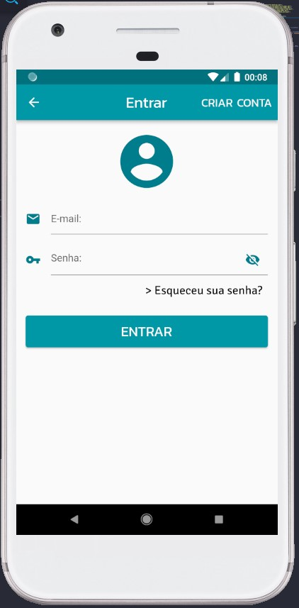
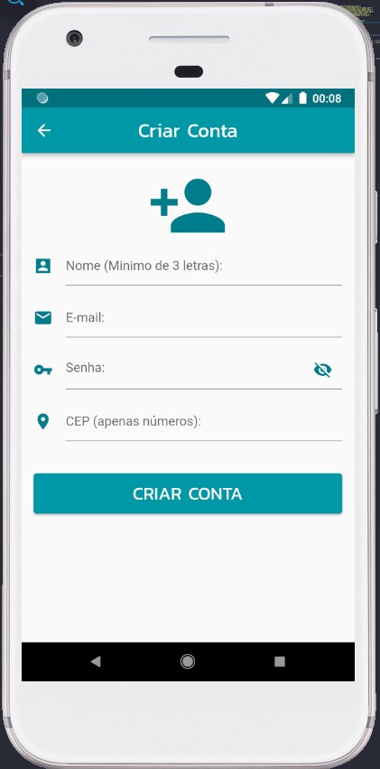
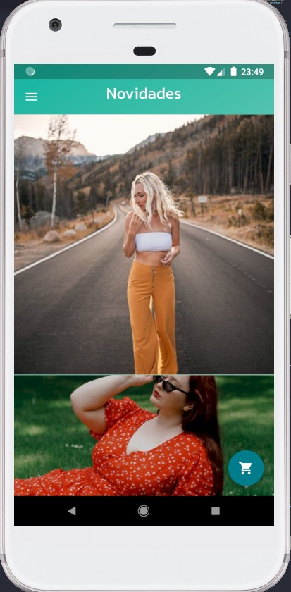
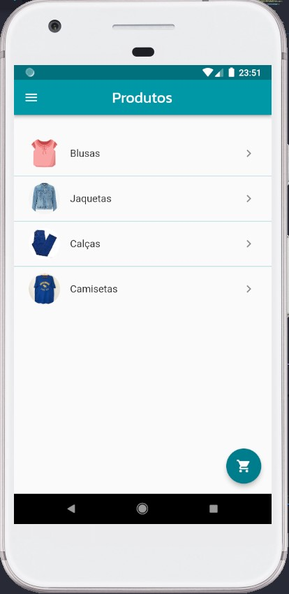

# App Shop Store

 

Autor: Jaasiel Antunes de Araujo.

# Sobre o projeto
O Shop Store é uma aplicação mobile construída com base em um curso de Flutter da plataforma Udemy onde eu utilizei como projeto para uma disciplina da faculdade onde estou cursando ciência da computação, durante o desenvolvimento da aplicação surgiram vários problemas
que fui resolvendo aos poucos com muita calma e sempre pesquisando e estudando a documentação para saber como cada componente se comporta. Consegui inserir algumas coisas que não foi mostrado no módulo do curso, pois julguei como forma de entregar algo mais completo.
O app tem como objetivo simular uma loja online de roupas com moda masculina e feminina na qual o usuário tem a opção de realizar o cadastro ou não para ter acesso ao app. O app não possui integração com pagamento. 

# Desafios do projeto:

- Entender como o back end iria funcionar;
- Aprender a implementar a parte do Firebase como cadastro e login do usuário;
- Aprender a sintaxe do Firebase;
- Aprender a adicionar novos recursos ao App;
- Aprender a lidar e resolver erros inesperados.

 

# Alguns prints das telas do App

 

    
    

 

    
    

